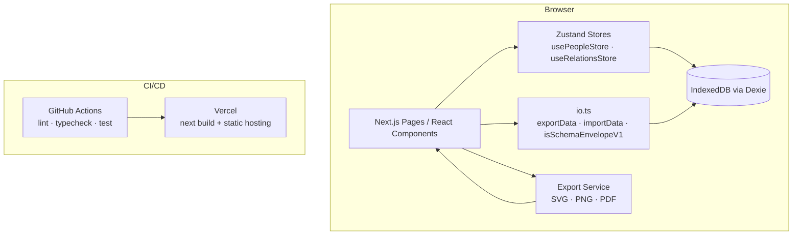

# Design Document: Family Tree App — Remaining Features

## Overview

This document covers the technical design for the remaining work on the Family Tree web application. The app already has a working foundation: people management, relationship management, tree visualization (React Flow + ELK), and JSON import/export. The remaining work falls into four areas:

1. **Media Export** — SVG, PNG, and PDF export from the tree canvas
2. **Persistence Safety Controls** — Backup, Restore, and Reset on the Data page
3. **Automated Testing** — Unit tests (stores, ELK layout, import/export round-trip) and integration tests
4. **CI/CD** — GitHub Actions pipeline and Vercel deployment

The app is local-first: all data lives in IndexedDB (Dexie) in the user's browser. There is no backend. This shapes every design decision — exports are client-side, backups are file downloads, and CI only needs to build and test, not deploy a server.

---

## Architecture

The existing architecture is unchanged. The new features layer on top of it:



Key architectural decisions:

- **SVG export** uses `@xyflow/react`'s built-in `getNodes`/`getEdges` snapshot plus a custom SVG serializer, avoiding a full DOM-to-image round-trip for vector output.
- **PNG and PDF export** continue using `html-to-image` (already in use) at 2× pixel ratio, with `jsPDF` for PDF (already in use).
- **Backup/Restore/Reset** are added to the existing `/data` page, reusing `exportData`/`importData` from `io.ts` and adding a `resetData` helper.
- **Testing** uses Vitest (fast, native ESM, compatible with Next.js) with `@testing-library/react` for integration tests and `fast-check` for property-based tests.
- **CI** uses GitHub Actions with a single workflow file running lint, typecheck, and tests on every PR.

---

## Components and Interfaces

### 1. Export Service (`src/lib/exportService.ts`)

A new module that centralises all three export formats. `TreeCanvas.tsx` currently has `exportPNG` and `exportPDF` inlined — these will be extracted here.

```ts
export async function exportSVG(containerEl: HTMLElement): Promise<void>
export async function exportPNG(containerEl: HTMLElement): Promise<void>
export async function exportPDF(containerEl: HTMLElement): Promise<void>
```

Each function:
- Accepts the React Flow container `HTMLElement` ref
- Throws a typed `ExportError` if the element is empty or conversion fails
- Triggers a browser download via a temporary `<a>` element

```ts
export class ExportError extends Error {
  constructor(public readonly format: 'svg' | 'png' | 'pdf', message: string) {
    super(message);
  }
}
```

SVG export uses `html-to-image`'s `toSvg` function (already a transitive dependency via `html-to-image`). The filter excludes `.react-flow__controls` and `.react-flow__minimap` nodes, consistent with the existing PNG/PDF logic.

### 2. TreeCanvas updates (`src/app/tree/TreeCanvas.tsx`)

- The page heading ("Tree") and export buttons share the same row using `flex items-center justify-between` for a balanced toolbar layout
- Add an "Export SVG" button alongside the existing PNG/PDF buttons
- Replace inline `exportPNG`/`exportPDF` with calls to `exportService`
- Wrap each export call in a `try/catch` that sets an `errorMessage` state string, displayed as a `<p>` below the buttons
- Guard all three buttons with `disabled={exporting || nodes.length === 0}`
- When no data exists, show a centered empty state message instead of the React Flow canvas

### 3. Data Page updates (`src/app/data/page.tsx`)

The Data page hydrates both `usePeopleStore` and `useRelationsStore` to display summary stats (people count, unions count, links count) above the Export button. The import strategy toggle includes helper text explaining what Replace and Merge do.

Three new sections added to the existing page:

**Backup section**
- "Backup" button calls `exportData()` and downloads a file named `family-tree-backup-{ISO timestamp}.json`
- Stores the last backup timestamp in `localStorage` key `lastBackupAt`
- Displays "Last backup: {relative time}" or "No backup yet"
- Displays current DB size (sum of serialized record sizes) in KB/MB

**Restore section**
- File input accepting `application/json`
- On file selection: parse → validate with `isSchemaEnvelopeV1` → show confirmation `AlertDialog` warning that all current data will be replaced
- On confirm: call `importData(envelope, 'replace')` then call `hydrate()` on both stores
- On validation failure: show inline error, do not open dialog

**Reset section**
- "Reset App Data" button opens a two-step `AlertDialog`:
  - Step 1: "Are you sure?" with Cancel / Continue
  - Step 2: "This will permanently delete all data. Type RESET to confirm." with a text input
- On confirmed: call `resetData()` (new helper in `io.ts`), call store hydration, navigate to `/`

### 4. `io.ts` additions

```ts
export async function resetData(): Promise<void>
export async function getDbSizeBytes(): Promise<number>
```

`resetData` clears all three Dexie tables in a single transaction.  
`getDbSizeBytes` serializes all records to JSON and returns the byte length — a reasonable approximation for IndexedDB size without requiring the StorageManager API.

### 5. Testing infrastructure

**Vitest config** (`vitest.config.ts`):
- `environment: 'jsdom'`
- `setupFiles: ['./src/test/setup.ts']`
- `globals: true`

**Setup file** (`src/test/setup.ts`):
- Mocks `dexie` with an in-memory fake using `fake-indexeddb`
- Imports `@testing-library/jest-dom` matchers

**Test files**:
| File | Covers |
|---|---|
| `src/lib/__tests__/store.test.ts` | Req 7 — store actions |
| `src/lib/__tests__/relationsStore.test.ts` | Req 7 — relations store actions |
| `src/lib/__tests__/elkLayout.test.ts` | Req 8 — ELK layout |
| `src/lib/__tests__/io.test.ts` | Req 9 — import/export round-trip |
| `src/app/__tests__/people.integration.test.tsx` | Req 10 — people flow |
| `src/app/__tests__/relations.integration.test.tsx` | Req 10 — relationships flow |
| `src/app/__tests__/dataFlow.integration.test.tsx` | Req 10 — export/import flow |

### 6. CI Pipeline (`.github/workflows/ci.yml`)

Single workflow triggered on `pull_request` targeting `main`:

```yaml
jobs:
  ci:
    runs-on: ubuntu-latest
    steps:
      - uses: actions/checkout@v4
      - uses: actions/setup-node@v4
        with: { node-version: 20, cache: npm }
      - run: npm ci
      - run: npm run lint
      - run: npx tsc --noEmit
      - run: npx vitest --run
```

Failure in any step marks the PR check as failed with the step's output as the summary.

---

## Data Models

No new persistent data models are introduced. The existing `SchemaEnvelopeV1` is the canonical backup format:

```ts
interface SchemaEnvelopeV1 {
  version: 1;
  people: PersonV1[];
  unions: UnionV1[];
  parentChildLinks: ParentChildV1[];
}
```

### Backup filename convention

```
family-tree-backup-{YYYY-MM-DDTHH-mm-ss}.json
```

Colons are replaced with hyphens for cross-platform filename safety.

### localStorage keys

| Key | Value | Purpose |
|---|---|---|
| `lastBackupAt` | ISO 8601 string | Displayed on Data page |

### DB size estimation

`getDbSizeBytes` computes:

```ts
JSON.stringify(await exportData()).length  // UTF-16 chars ≈ bytes for ASCII-heavy data
```

This is displayed as KB (÷ 1024) or MB (÷ 1048576) with one decimal place.

---

## Correctness Properties

*A property is a characteristic or behavior that should hold true across all valid executions of a system — essentially, a formal statement about what the system should do. Properties serve as the bridge between human-readable specifications and machine-verifiable correctness guarantees.*

### Property 1: SVG output validity and completeness

*For any* React Flow canvas state containing N person nodes, M union nodes, and E edges, the SVG string produced by `exportSVG` should be a valid SVG document (starts with `<svg`, is well-formed XML) and should contain at least N + M rendered node elements and E edge elements.

**Validates: Requirements 1.1, 1.2**

---

### Property 2: PDF layout fits page bounds

*For any* image with arbitrary width and height, the PDF layout calculation should produce render dimensions where `renderWidth ≤ pageWidth - 48` and `renderHeight ≤ pageHeight - 48`, and the aspect ratio of the rendered image should equal the aspect ratio of the original image (within floating-point tolerance).

**Validates: Requirements 3.2**

---

### Property 3: DB size formatting produces valid human-readable string

*For any* `SchemaEnvelopeV1` object, `getDbSizeBytes` should return a non-negative number, and the formatted display string should match the pattern `/^\d+(\.\d+)? (KB|MB)$/`.

**Validates: Requirements 4.3**

---

### Property 4: Schema validation correctly classifies all inputs

*For any* JavaScript value, `isSchemaEnvelopeV1` should return `true` if and only if the value is an object with `version === 1` and array-typed `people`, `unions`, and `parentChildLinks` fields. For any other value it should return `false`.

**Validates: Requirements 5.1**

---

### Property 5: Restore round-trip preserves all data

*For any* valid `SchemaEnvelopeV1` envelope, calling `importData(envelope, 'replace')` followed by `exportData()` should produce an envelope that is deeply equal to the original (same people, unions, and parentChildLinks by id and field values).

**Validates: Requirements 5.3, 9.1, 9.2**

---

### Property 6: Reset empties all tables

*For any* DB state (any number of people, unions, and parentChildLinks), calling `resetData()` should result in all three tables being empty — `db.people.count()`, `db.unions.count()`, and `db.parentChildLinks.count()` should all return 0.

**Validates: Requirements 6.2**

---

### Property 7: People store CRUD correctness

*For any* valid person input, the following should hold:
- After `addPerson(input)`, the store's `people` array should contain a record matching the input fields
- After `updatePerson(id, updates)`, the store's record for that id should reflect the updated fields
- After `deletePerson(id)`, the store's `people` array should not contain any record with that id

**Validates: Requirements 7.1**

---

### Property 8: Relations store CRUD correctness

*For any* valid union or parent-child link input, the following should hold:
- After `addUnion(partnerIds)`, the store's `unions` array should contain a record with those partnerIds
- After `deleteUnion(id)`, the store's `unions` array should not contain that id
- After `addParentChildLink(parentIds, childId)`, the store's `parentChildLinks` array should contain a matching record
- After `deleteParentChildLink(id)`, the store's `parentChildLinks` array should not contain that id

**Validates: Requirements 7.2**

---

### Property 9: Store rollback on DB error

*For any* store state and any store action (add, update, delete) that causes the underlying Dexie call to throw, the store's in-memory state after the error should be identical to the state before the action was dispatched.

**Validates: Requirements 7.3**

---

### Property 10: ELK layout produces non-overlapping positions for any valid graph

*For any* valid family graph (any number of person nodes, union nodes, and edges), `layoutWithElk` should resolve without throwing, and no two nodes in the output should have overlapping bounding boxes (i.e., for all pairs of nodes i, j: their rectangles defined by `position.x`, `position.y`, `width`, `height` should not intersect).

**Validates: Requirements 8.1, 8.3**

---

### Property 11: JSON serialization round-trip

*For any* valid `SchemaEnvelopeV1` object, `JSON.parse(JSON.stringify(envelope))` should produce a value that is deeply equal to the original envelope.

**Validates: Requirements 9.1**

---

### Property 12: Integration export/import round-trip

*For any* DB state, the sequence: `exportData()` → clear DB → `importData(exported, 'replace')` → `exportData()` should produce a second export that is deeply equal to the first export (same people, unions, and parentChildLinks).

**Validates: Requirements 10.3**

---

## Error Handling

### Export errors

All three export functions (`exportSVG`, `exportPNG`, `exportPDF`) throw `ExportError` on failure. `TreeCanvas` catches these and sets an `errorMessage` state string rendered below the export buttons. The error is cleared on the next successful export or on the next user interaction with the export buttons.

Empty-canvas guard: if `nodes.length === 0`, the buttons are disabled and no export is attempted (Req 1.3, 2.3, 3.3 are satisfied by the disabled state + a tooltip).

### Restore errors

- **Parse failure** (invalid JSON): caught in the file handler, displayed as inline error text
- **Schema validation failure**: `isSchemaEnvelopeV1` returns false → inline error, dialog never opens
- **DB write failure**: `importData` throws → caught, displayed as inline error, DB left in previous state (Dexie transaction rolls back automatically)

### Reset errors

- **DB clear failure**: `resetData` throws → caught, displayed as inline error, no navigation

### Store rollback

Both Zustand stores use optimistic updates with try/catch rollback (already implemented). Any DB error restores the previous in-memory state.

### CI failures

GitHub Actions reports each failed step with its stdout/stderr as the PR check detail. No additional error handling is needed beyond the default Actions behavior.

---

## Testing Strategy

### Tooling

| Tool | Purpose |
|---|---|
| **Vitest** | Test runner (fast, native ESM, no Babel needed for Next.js) |
| **@testing-library/react** | Integration tests for React components |
| **fake-indexeddb** | In-memory IndexedDB for unit/integration tests |
| **fast-check** | Property-based testing library |
| **@testing-library/jest-dom** | DOM matchers |
| **@testing-library/user-event** | User interaction simulation |

Install additions: `vitest`, `@vitejs/plugin-react`, `@testing-library/react`, `@testing-library/jest-dom`, `@testing-library/user-event`, `fake-indexeddb`, `fast-check`, `jsdom`.

### Dual Testing Approach

Unit tests and property tests are complementary:
- **Unit tests** cover specific examples, integration points, and edge cases
- **Property tests** verify universal invariants across randomly generated inputs

### Unit Tests

**`src/lib/__tests__/store.test.ts`** (Req 7.1)
- Example: add a person → store contains that person
- Example: update a person → store reflects updated fields
- Example: delete a person → store no longer contains that person
- Edge case: DB throws on add → store rolls back (Property 9)

**`src/lib/__tests__/relationsStore.test.ts`** (Req 7.2)
- Example: add a union → store contains that union
- Example: delete a union → store no longer contains it
- Example: add a parent-child link → store contains it
- Example: delete a parent-child link → store no longer contains it
- Edge case: DB throws → store rolls back (Property 9)

**`src/lib/__tests__/elkLayout.test.ts`** (Req 8)
- Edge case: empty graph → resolves without throwing (Req 8.2)
- Example: 3-generation graph → all nodes have valid positions

**`src/lib/__tests__/io.test.ts`** (Req 9)
- Edge case: import with `version: 2` → throws, DB unchanged (Req 9.3)
- Edge case: import with missing arrays → `isSchemaEnvelopeV1` returns false

### Property-Based Tests

Each property test runs a minimum of **100 iterations**. Each test is tagged with a comment in the format:
`// Feature: family-tree-app, Property N: <property text>`

**Property 4: Schema validation** (`src/lib/__tests__/io.test.ts`)
```
// Feature: family-tree-app, Property 4: isSchemaEnvelopeV1 correctly classifies all inputs
fc.assert(fc.property(fc.anything(), (value) => {
  const result = isSchemaEnvelopeV1(value);
  // result is true iff value matches the schema
}), { numRuns: 100 });
```

**Property 5: Restore round-trip** (`src/lib/__tests__/io.test.ts`)
```
// Feature: family-tree-app, Property 5: export → import → export produces equivalent envelope
fc.assert(fc.property(arbitraryEnvelope, async (envelope) => {
  await importData(envelope, 'replace');
  const exported = await exportData();
  expect(exported).toEqual(envelope);
}), { numRuns: 100 });
```

**Property 6: Reset empties all tables** (`src/lib/__tests__/io.test.ts`)
```
// Feature: family-tree-app, Property 6: resetData empties all tables
fc.assert(fc.property(arbitraryEnvelope, async (envelope) => {
  await importData(envelope, 'replace');
  await resetData();
  expect(await db.people.count()).toBe(0);
  expect(await db.unions.count()).toBe(0);
  expect(await db.parentChildLinks.count()).toBe(0);
}), { numRuns: 100 });
```

**Property 7: People store CRUD** (`src/lib/__tests__/store.test.ts`)
```
// Feature: family-tree-app, Property 7: addPerson/updatePerson/deletePerson correctness
fc.assert(fc.property(arbitraryPersonInput, async (input) => {
  const id = await store.addPerson(input);
  expect(store.people.find(p => p.id === id)).toMatchObject(input);
  await store.deletePerson(id);
  expect(store.people.find(p => p.id === id)).toBeUndefined();
}), { numRuns: 100 });
```

**Property 8: Relations store CRUD** (`src/lib/__tests__/relationsStore.test.ts`)
```
// Feature: family-tree-app, Property 8: addUnion/deleteUnion/addParentChildLink/deleteParentChildLink correctness
```

**Property 9: Store rollback** (both store test files)
```
// Feature: family-tree-app, Property 9: store rolls back on DB error
```

**Property 10: ELK layout non-overlapping** (`src/lib/__tests__/elkLayout.test.ts`)
```
// Feature: family-tree-app, Property 10: layoutWithElk produces non-overlapping positions
fc.assert(fc.property(arbitraryFamilyGraph, async ({ nodes, edges }) => {
  const { nodes: laid } = await layoutWithElk(nodes, edges);
  // check all pairs for non-overlap
}), { numRuns: 100 });
```

**Property 11: JSON serialization round-trip** (`src/lib/__tests__/io.test.ts`)
```
// Feature: family-tree-app, Property 11: JSON.parse(JSON.stringify(envelope)) deep-equals original
fc.assert(fc.property(arbitraryEnvelope, (envelope) => {
  expect(JSON.parse(JSON.stringify(envelope))).toEqual(envelope);
}), { numRuns: 100 });
```

**Property 2: PDF layout fits page bounds** (`src/lib/__tests__/exportService.test.ts`)
```
// Feature: family-tree-app, Property 2: PDF render dimensions fit within page bounds
fc.assert(fc.property(fc.record({ w: fc.nat(), h: fc.nat() }), ({ w, h }) => {
  const { renderWidth, renderHeight } = computePdfLayout(w, h, pageWidth, pageHeight);
  expect(renderWidth).toBeLessThanOrEqual(pageWidth - 48);
  expect(renderHeight).toBeLessThanOrEqual(pageHeight - 48);
}), { numRuns: 100 });
```

### Integration Tests

**`src/app/__tests__/people.integration.test.tsx`** (Req 10.1)
- Render the people page, add a person via the dialog, verify it appears in the table, edit it, verify the update, delete it, verify it's gone

**`src/app/__tests__/relations.integration.test.tsx`** (Req 10.2)
- Add two people, create a union between them, add a parent-child link, verify the relations store reflects both

**`src/app/__tests__/dataFlow.integration.test.tsx`** (Req 10.3, Property 12)
```
// Feature: family-tree-app, Property 12: integration export → clear → import restores original data
```
- Seed DB, export, clear, import, re-export, deep-equal comparison

### npm scripts additions

```json
"test": "vitest --run",
"test:watch": "vitest",
"typecheck": "tsc --noEmit"
```
