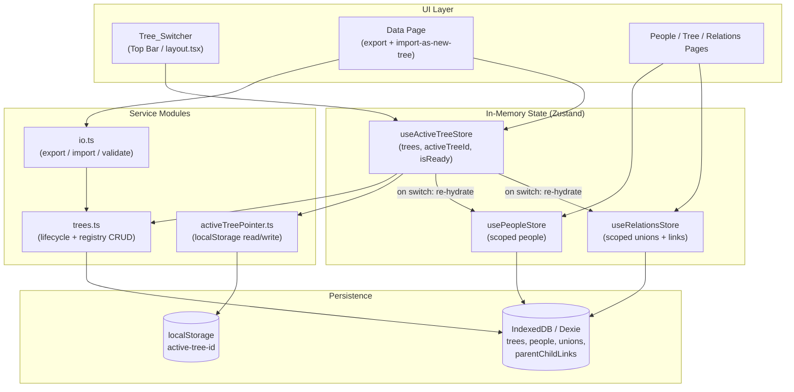
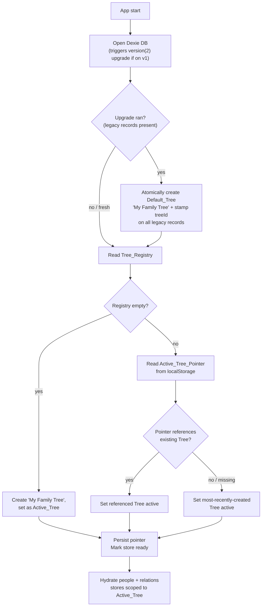
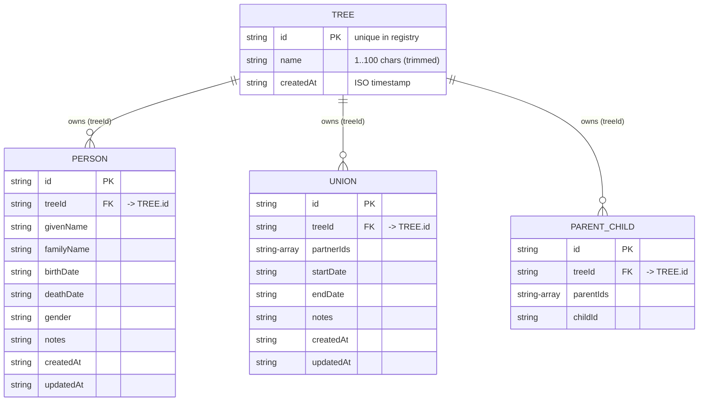

# Design Document

## Overview

This feature evolves the Family Tree app from a single implicit dataset into a registry of multiple, fully isolated family trees that live side by side in the same browser. Each tree owns its own people, unions, and parent-child links; the user picks one **Active_Tree** at a time, and every existing page (People, Tree, Relationships, Data) operates only on that tree's records.

The app stays local-first: all persistence is IndexedDB via Dexie, in-memory state is Zustand, and nothing leaves the device. The design introduces four moving parts:

1. **A `trees` registry table** plus a `treeId` association stamped on every record (Dexie schema `version(2)`).
2. **An active-tree layer** — a Zustand store backed by a small `localStorage` pointer — that resolves, persists, and switches the active tree.
3. **A tree-lifecycle service** (`src/lib/trees.ts`) that owns create / rename / delete / import-as-new-tree and the registry CRUD, keeping the never-zero-trees invariant.
4. **A one-time data migration** (run inside the Dexie `version(2)` upgrade) that adopts pre-existing single-tree records into a Default_Tree named "My Family Tree", preserving every other field.

The existing `usePeopleStore` and `useRelationsStore` become tree-scoped: their `hydrate()` reads the active tree id and queries only matching records, and they re-hydrate whenever the active tree changes. The `Tree_Switcher` lives in the top bar (`layout.tsx`); export/import-as-new-tree controls live on the Data page.

Design decisions are grounded in the requirements at `.kiro/specs/multiple-family-trees/requirements.md` and the established UI patterns in `.kiro/steering/ui-conventions.md`.

### Key Design Decisions

| Decision | Rationale | Requirements |
|---|---|---|
| Store `treeId` on each record (not separate per-tree tables) | Minimal schema change; a single indexed column gives O(log n) scoping queries and keeps the existing CRUD shape | 1.2, 1.3 |
| Keep `SchemaEnvelopeV1` portable (no `treeId` in the file) | Export files stay device/tree-agnostic; import assigns a fresh `treeId`, so files round-trip cleanly into any tree | 7.4, 9.1, 9.3 |
| Active-tree pointer in `localStorage`, registry in IndexedDB | The pointer is a tiny scalar that must survive reloads and be read synchronously at startup; the registry is structured data that belongs with the records | 2.2, 2.4 |
| Run data migration inside Dexie `version(2).upgrade()` | Dexie runs each upgrade exactly once per client and wraps it in an atomic transaction — this *is* the idempotent, all-or-nothing "migration-completed indicator" the requirements ask for | 8.1, 8.5, 8.6 |
| A single `trees.ts` service owns lifecycle + invariants | Centralizes the "never zero trees" and "active tree always valid" rules so UI components stay thin | 4, 5, 6 |

---

## Architecture

The feature adds an **active-tree coordination layer** between the UI and the existing Dexie/Zustand data layer. The registry and the scoped record stores both live in IndexedDB; the active-tree pointer lives in `localStorage`.



### Startup / Active-Tree Resolution Flow

This flow runs once on app load (driven from `layout.tsx`) and establishes the invariant that exactly one valid Active_Tree exists whenever the registry is non-empty.



### Switching the Active Tree (runtime)

When the user picks a different tree in the `Tree_Switcher`, or lifecycle actions change the active tree, a single coordinator transition runs:

1. Capture the current `activeTreeId` (for rollback).
2. Set the new `activeTreeId` in `useActiveTreeStore`.
3. Persist the pointer to `localStorage`.
4. Re-hydrate `usePeopleStore` and `useRelationsStore` from the DB scoped to the new id.
5. On any failure in steps 3–4, roll back to the captured id and surface an error indication; the previous tree's data stays visible (Req 2.7, 3.8).

---

## Components and Interfaces

### 1. Domain & Storage Types (`src/lib/domain.ts`)

The existing `PersonV1`, `UnionV1`, `ParentChildV1`, and `SchemaEnvelopeV1` remain the **portable** shapes (they are what lives inside an export file — no `treeId`). A new `Tree` type and a `Scoped<T>` helper describe what is **persisted** in Dexie.

```typescript
export type Id = string;

// Portable domain types (UNCHANGED) — used in SchemaEnvelopeV1 files.
export interface PersonV1 { /* ...existing fields... */ }
export interface UnionV1 { /* ...existing fields... */ }
export interface ParentChildV1 { /* ...existing fields... */ }
export interface SchemaEnvelopeV1 {
  version: 1;
  people: PersonV1[];
  unions: UnionV1[];
  parentChildLinks: ParentChildV1[];
}

// NEW: registry entry
export interface Tree {
  id: Id;            // unique across the registry (nanoid)
  name: string;      // 1..100 chars (trimmed), duplicates allowed
  createdAt: string; // ISO timestamp
}

// NEW: what Dexie stores = portable record + its tree association
export type Scoped<T> = T & { treeId: Id };
export type StoredPerson = Scoped<PersonV1>;
export type StoredUnion = Scoped<UnionV1>;
export type StoredParentChild = Scoped<ParentChildV1>;

export const MAX_TREE_NAME_LENGTH = 100;
export const DEFAULT_TREE_NAME = 'My Family Tree';
```

### 2. Database Layer (`src/lib/db.ts`)

Adds the `trees` table, bumps to `version(2)`, indexes `treeId`, and scopes the record helpers. Record CRUD helpers now require/return the scoped form, and read helpers take a `treeId`.

```typescript
export class FamilyTreeDB extends Dexie {
  trees!: Table<Tree, Id>;
  people!: Table<StoredPerson, Id>;
  unions!: Table<StoredUnion, Id>;
  parentChildLinks!: Table<StoredParentChild, Id>;

  constructor() {
    super('family-tree-db');

    // Existing v1 (kept for upgrade path)
    this.version(1).stores({
      people: 'id, givenName, familyName, createdAt, updatedAt',
      unions: 'id, createdAt, updatedAt',
      parentChildLinks: 'id, childId',
    });

    // v2: add trees table + treeId indexes, then migrate legacy data.
    this.version(2).stores({
      trees: 'id, createdAt',
      people: 'id, treeId, givenName, familyName, createdAt, updatedAt',
      unions: 'id, treeId, createdAt, updatedAt',
      parentChildLinks: 'id, treeId, childId',
    }).upgrade(async (tx) => {
      await migrateLegacyRecordsToDefaultTree(tx); // see Migration section
    });
  }
}

// Registry CRUD
export async function getAllTrees(): Promise<Tree[]>;            // ordered by createdAt desc
export async function addTree(tree: Tree): Promise<void>;
export async function renameTree(id: Id, name: string): Promise<void>;
export async function deleteTreeCascade(id: Id): Promise<void>;  // atomic: tree + its records

// Scoped record reads (Req 1.3)
export async function getPeopleByTree(treeId: Id): Promise<StoredPerson[]>;
export async function getUnionsByTree(treeId: Id): Promise<StoredUnion[]>;
export async function getParentChildLinksByTree(treeId: Id): Promise<StoredParentChild[]>;

// Scoped record writes carry treeId on the entity; deletes by id are unaffected.
```

`deleteTreeCascade` runs in a single `rw` transaction across all four tables: it removes the tree row and every record `where('treeId').equals(id)` (Req 6.2, 1.7).

### 3. Active-Tree Pointer (`src/lib/activeTreePointer.ts`)

A thin, synchronous wrapper over `localStorage` so the pointer can be read at the very start of app boot.

```typescript
const KEY = 'family-tree:active-tree-id';

export function readActiveTreePointer(): Id | null;     // null if missing/unreadable
export function writeActiveTreePointer(id: Id): void;   // throws on quota/security errors
export function clearActiveTreePointer(): void;
```

Errors thrown by `writeActiveTreePointer` are caught by callers to satisfy Req 2.7 (retain session selection, show "could not be saved").

### 4. Tree Lifecycle Service (`src/lib/trees.ts`)

Owns all multi-tree business rules and the never-zero-trees invariant. Pure-ish: it validates input, mutates the registry/records via `db.ts`, and returns results; it does not touch React.

```typescript
export type CreateResult =
  | { ok: true; tree: Tree }
  | { ok: false; reason: 'empty' | 'too-long' };

// Validation shared by create / rename / import naming (Req 4, 5, 7.7).
export function normalizeTreeName(raw: string): CreateResult extends never ? never : 
  { ok: true; name: string } | { ok: false; reason: 'empty' | 'too-long' };

export async function createTree(name: string): Promise<CreateResult>;       // Req 4
export async function renameTreeChecked(id: Id, name: string): Promise<      // Req 5
  { ok: true } | { ok: false; reason: 'empty' | 'too-long' }>;
export async function deleteTree(id: Id): Promise<void>;                      // Req 6.2 (cascade)

// Build the records for a brand-new tree from a validated envelope (Req 7.4).
export function buildTreeFromEnvelope(
  envelope: SchemaEnvelopeV1, treeId: Id,
): { people: StoredPerson[]; unions: StoredUnion[]; parentChildLinks: StoredParentChild[] };

// Default name derivation for import when no name given (Req 7.8).
export function deriveImportTreeName(providedName: string | undefined, fileName?: string): string;

// Pick the most-recently-created tree (Req 2.5, 5-? , 6.3).
export function mostRecentTree(trees: Tree[]): Tree | undefined;
```

### 5. Active-Tree Store (`src/lib/activeTreeStore.ts`)

The orchestration hub. Holds the registry copy + active id, drives bootstrap/resolution, and coordinates re-hydration of the record stores.

```typescript
type ActiveTreeState = {
  trees: Tree[];
  activeTreeId: Id | null;
  isReady: boolean;            // bootstrap finished
  status: 'ok' | 'no-selection' | 'unavailable'; // drives UI indications (Req 1.5, 1.6)
  error: string | null;

  bootstrap: () => Promise<void>;                  // startup flow (Req 2.4–2.6, 8.2)
  setActiveTree: (id: Id) => Promise<void>;        // switch + re-hydrate (Req 2.3, 3.3, 3.7, 3.8)
  createTree: (name: string) => Promise<CreateResult>;       // Req 4 (+ activate)
  renameActiveOrTree: (id: Id, name: string) => Promise<...>;// Req 5
  deleteTree: (id: Id) => Promise<void>;           // Req 6 (+ invariant + re-resolve)
  importAsNewTree: (envelope: SchemaEnvelopeV1, name: string | undefined, fileName?: string)
    => Promise<{ ok: true; tree: Tree } | { ok: false; reason: string }>; // Req 7
  refreshRegistry: () => Promise<void>;            // reload trees[] after lifecycle ops
};
```

**Re-hydration coupling:** `setActiveTree` (and any lifecycle op that changes the active id) performs the switch transition described in Architecture: persist pointer → call `usePeopleStore.getState().hydrate()` and `useRelationsStore.getState().hydrate()`. Those `hydrate()` functions read `useActiveTreeStore.getState().activeTreeId` and query the scoped read helpers. On failure they roll back the active id and set `error`/`status`.

### 6. Scoped Record Stores (`src/lib/store.ts`, `src/lib/relationsStore.ts`)

`hydrate()` becomes tree-aware; create operations stamp the active `treeId`.

```typescript
// usePeopleStore.hydrate()
hydrate: async () => {
  const treeId = useActiveTreeStore.getState().activeTreeId;
  if (!treeId) { set({ people: [], isHydrated: true }); return; } // Req 1.5
  const people = await getPeopleByTree(treeId);                    // Req 1.3
  set({ people, isHydrated: true });
}

// addPerson stamps treeId so writes belong to the Active_Tree (Req 1.4)
addPerson: async (input) => {
  const treeId = useActiveTreeStore.getState().activeTreeId;
  if (!treeId) throw new Error('No active tree');
  const person: StoredPerson = { id: nanoid(), treeId, createdAt, updatedAt, ...input };
  // optimistic add + db write + rollback (unchanged pattern)
}
```

`useRelationsStore` changes identically for `addUnion` / `addParentChildLink`.

### 7. Tree Switcher UI (`src/components/TreeSwitcher.tsx`, mounted in `layout.tsx`)

Follows `ui-conventions.md`: a shadcn `Select` for the list, an inline rename/delete affordance via `Dialog` + `AlertDialog`, placed in the top bar to the left of the theme toggle.

- Trigger shows the Active_Tree name, truncated past 40 chars with `max-w-[…] truncate` (Req 3.1).
- Options list trees ordered most-recent-first (Req 3.2) and visually marks the active one with a check icon (`lucide-react` `Check`) (Req 3.6).
- Selecting the active tree is a no-op (Req 3.7); selecting another calls `setActiveTree` (Req 3.3).
- A "New tree…" action opens a create `Dialog`; per-tree rename opens a rename `Dialog`; delete opens an `AlertDialog` confirmation that names the tree and warns of permanent record removal (Req 6.1).

### 8. Data Page Controls (`src/app/data/page.tsx`)

- **Export** now calls `exportActiveTree()` (scoped) and the header displays the Active_Tree name (Req 9.2).
- A new **"Import as new tree"** control: choose file → read → `JSON.parse` → `isSchemaEnvelopeV1` validation → optional name `Input` → confirm → `importAsNewTree`. Validation failures show messages and change nothing (Req 7.1–7.3); success activates the new tree and re-hydrates (Req 7.6).

### 9. I/O Module (`src/lib/io.ts`)

```typescript
// Scoped export: filter by active tree, strip treeId to keep the file portable (Req 9.1, 9.5).
export async function exportActiveTree(treeId: Id): Promise<SchemaEnvelopeV1>;

// isSchemaEnvelopeV1 — UNCHANGED, reused by import-as-new-tree (Req 7.1).
// The legacy importData(replace|merge) is superseded by import-as-new-tree for this feature.
```

---

## Data Models

### Entity Relationships



### Persistence Map

| Store | Where | Keyed by | Indexes | Notes |
|---|---|---|---|---|
| `trees` | IndexedDB (Dexie v2) | `id` | `createdAt` | The Tree_Registry (Req 1.1) |
| `people` | IndexedDB (Dexie v2) | `id` | `treeId`, name fields, timestamps | `StoredPerson` (Req 1.2) |
| `unions` | IndexedDB (Dexie v2) | `id` | `treeId`, timestamps | `StoredUnion` |
| `parentChildLinks` | IndexedDB (Dexie v2) | `id` | `treeId`, `childId` | `StoredParentChild` |
| Active_Tree_Pointer | `localStorage` | key `family-tree:active-tree-id` | — | Scalar id, survives reload (Req 2.2, 2.4) |
| Migration indicator | IndexedDB (Dexie schema version) | — | — | Version 2 persisted by Dexie; upgrade runs once (Req 8.5) |

### Migration Model (`migrateLegacyRecordsToDefaultTree`)

Runs inside the Dexie `version(2).upgrade(tx)` callback, in a single atomic transaction (Req 8.1, 8.6):

1. Query all records in `people`, `unions`, `parentChildLinks` that have no `treeId`.
2. If none exist, return without creating a tree (fresh installs are handled by bootstrap's empty-registry branch).
3. Otherwise create one Default_Tree `{ id: nanoid(), name: "My Family Tree", createdAt: now }`.
4. For each legacy record, set **only** `treeId` to the Default_Tree id via `tx.table(...).update(id, { treeId })` — every other field is untouched (Req 8.3), and no record is added or removed (Req 8.4).
5. If the transaction throws, Dexie aborts it: schema stays at v1, no Default_Tree, records stay unassociated, and bootstrap surfaces a "could not be migrated" error (Req 8.6).

Because Dexie persists the installed schema version and never re-runs a completed upgrade, the schema version itself is the durable, idempotent migration-completed indicator (Req 8.5). `bootstrap()` then sets the Default_Tree as Active_Tree and persists the pointer (Req 8.2).

---

## Correctness Properties

*A property is a characteristic or behavior that should hold true across all valid executions of a system — essentially, a formal statement about what the system should do. Properties serve as the bridge between human-readable specifications and machine-verifiable correctness guarantees.*

These properties were derived from the acceptance-criteria prework analysis and consolidated to remove redundancy (e.g., the "only new tree visible after switch" criterion is subsumed by the load-isolation property; all four name-length criteria collapse into one validation property; the cascade-delete criteria merge into one property).

### Property 1: Active-tree load isolation

*For any* registry containing multiple trees with their own records, hydrating the stores for a chosen Active_Tree loads exactly that tree's people, unions, and parent-child links and excludes every record belonging to any other tree.

**Validates: Requirements 1.3, 3.3, 3.4**

### Property 2: Record mutation is tree-scoped

*For any* registry with multiple trees, creating, updating, or deleting a record while a tree is active changes only that tree's records and leaves every other tree's records byte-for-byte unchanged.

**Validates: Requirements 1.4**

### Property 3: Referential integrity and single active tree

*For any* sequence of tree-lifecycle and record operations, every stored record's `treeId` references a tree that exists in the registry, and whenever the registry is non-empty exactly one Active_Tree is set and it references an existing tree.

**Validates: Requirements 1.2, 2.1**

### Property 4: Cascade delete isolation

*For any* registry, deleting a tree removes that tree's registry entry and exactly the records associated with its id, while leaving the registry entries and records of all other trees unchanged.

**Validates: Requirements 1.7, 6.2, 6.5**

### Property 5: Create tree

*For any* name whose trimmed length is between 1 and 100 inclusive, creating a tree adds a registry entry whose stored name equals the trimmed input with zero associated records, sets the new tree as the Active_Tree, and succeeds even when the trimmed name duplicates an existing tree's name.

**Validates: Requirements 4.1, 4.2, 4.3**

### Property 6: Invalid tree name is rejected without side effects

*For any* name whose trimmed length is 0 or greater than 100, both the create and rename actions are rejected and leave the registry, all records, the targeted tree's existing name, and the Active_Tree unchanged.

**Validates: Requirements 4.4, 4.5, 5.3, 5.4**

### Property 7: Rename updates only the name

*For any* tree and any name whose trimmed length is between 1 and 100, renaming sets that tree's stored display name to the trimmed value (a subsequent read returns it) and leaves the records of that tree and all other trees unchanged.

**Validates: Requirements 5.1, 5.5**

### Property 8: Active-tree resolution

*For any* registry and persisted pointer, resolution selects the pointed-to tree when the pointer references an existing tree, and otherwise selects the tree with the most recent creation timestamp.

**Validates: Requirements 2.4, 2.5, 6.3**

### Property 9: Never zero trees

*For any* registry containing exactly one tree, confirming deletion of that tree results in a registry containing exactly one tree named "My Family Tree" that is set as the Active_Tree.

**Validates: Requirements 6.4**

### Property 10: Selecting the active tree is idempotent

*For any* registry, selecting the tree that is already the Active_Tree leaves the Active_Tree identifier and the contents of the record stores unchanged.

**Validates: Requirements 3.7**

### Property 11: Active-tree pointer round-trip

*For any* tree identifier, writing it to the Active_Tree_Pointer and then reading the pointer back returns the same identifier.

**Validates: Requirements 2.2**

### Property 12: Switcher ordering

*For any* registry, the list presented by the Tree_Switcher contains exactly the registry's trees and is ordered by creation timestamp with the most recently created tree first.

**Validates: Requirements 3.2**

### Property 13: Active-tree name truncation

*For any* tree name, the label rendered by the Tree_Switcher equals the name when its length is at most 40 characters, and otherwise is a bounded string of at most 40 characters that is a prefix of the name (plus an ellipsis indicator).

**Validates: Requirements 3.1**

### Property 14: Migration preserves all data

*For any* set of pre-existing records that are not associated with any tree, the migration assigns the Default_Tree identifier to every such record, preserves every other field value of each record exactly, and produces a record set whose identifiers are exactly the original identifiers with none added and none removed.

**Validates: Requirements 8.1, 8.3, 8.4**

### Property 15: Migration is idempotent

*For any* database on which migration has already completed, running the startup bootstrap again creates no additional Default_Tree and duplicates no records.

**Validates: Requirements 8.5**

### Property 16: Import as a new tree is isolated and complete

*For any* valid SchemaEnvelopeV1, importing it as a new tree adds one new registry entry, associates every person, union, and parent-child link from the file with the new tree's identifier, sets the new tree as the Active_Tree, and leaves the registry entries and records of all previously existing trees unchanged.

**Validates: Requirements 7.4, 7.5, 7.6**

### Property 17: Invalid import is rejected without side effects

*For any* value that fails SchemaEnvelopeV1 validation, the import is rejected and the registry and all records remain unchanged.

**Validates: Requirements 7.1, 7.3**

### Property 18: Import tree naming

*For any* user-provided name containing at least one non-whitespace character, the imported tree is named with the trimmed value; for any empty or whitespace-only provided name, the imported tree is named with the source file name when available and otherwise with a date-derived default.

**Validates: Requirements 7.7, 7.8**

### Property 19: Scoped export exactness

*For any* Active_Tree, the exported SchemaEnvelopeV1 contains exactly the people, unions, and parent-child links associated with that tree (with the `treeId` association stripped), excludes every record of any other tree, and is a valid version-1 envelope with empty collections when the Active_Tree has no records.

**Validates: Requirements 9.1, 9.5**

### Property 20: Export then import round-trip

*For any* tree, exporting it to a SchemaEnvelopeV1 and then importing that file as a new tree produces a tree whose people, unions, and parent-child links correspond one-to-one with the original tree's records by identifier and by every portable field value, with no records added and none missing.

**Validates: Requirements 9.3**

---

## Error Handling

The app is local-first with no network, so error handling centers on IndexedDB transaction failures, `localStorage` write failures, and malformed import files. Every failure path must leave persisted state untouched and surface a clear, non-technical indication.

| Scenario | Detection | Handling | Requirement |
|---|---|---|---|
| No Active_Tree set when loading | `activeTreeId == null` in `hydrate()` | Load empty stores; set `status='no-selection'`; UI shows "No tree selected" | 1.5 |
| Active id references missing tree | resolved tree not found in registry | Load empty stores; set `status='unavailable'`; UI shows "Selected tree is unavailable" | 1.6 |
| Pointer write fails (quota/security) | `writeActiveTreePointer` throws | Catch; keep current `activeTreeId` for the session; set `error="Selection could not be saved"` | 2.7 |
| Store reload fails during switch | `hydrate()` rejects | Roll back `activeTreeId` to previous; keep previous tree's data visible; set `error="Tree could not be loaded"` | 3.8 |
| Create/rename invalid name | `normalizeTreeName` returns `{ok:false}` | No DB write; return reason `empty` or `too-long`; UI shows the matching message | 4.4, 4.5, 5.3, 5.4 |
| Delete fails mid-transaction | `deleteTreeCascade` rejects (Dexie aborts the `rw` tx atomically) | Tree and its records remain; Active_Tree unchanged; set `error="Tree could not be deleted"` | 6.7 |
| Import file unreadable / not JSON | `file.text()` or `JSON.parse` throws | No registry/record change; UI shows "The file could not be read" | 7.2 |
| Import file fails schema validation | `isSchemaEnvelopeV1` returns false | No registry/record change; UI shows "The file failed validation" | 7.3 |
| Migration transaction fails | Dexie `version(2).upgrade` callback throws | Dexie aborts the upgrade atomically: schema stays v1, no Default_Tree, no version bump; bootstrap shows "Data could not be migrated" | 8.6 |
| Export fails to produce file | `exportActiveTree` or blob/anchor step throws | No state change; UI shows "Export did not complete" | 9.4 |

**Atomicity guarantees.** Cascade delete, import-as-new-tree, and migration each run inside a single Dexie `transaction('rw', ...)` so they commit fully or not at all. This is what makes the "leave everything unchanged on failure" requirements (6.7, 7.2, 7.3, 8.6, 9.4) hold without manual rollback bookkeeping.

**Optimistic-update rollback.** The existing `usePeopleStore` / `useRelationsStore` pattern (optimistic `set` then DB write, reverting on throw) is preserved; the only change is that the optimistic record now carries `treeId`.

---

## Testing Strategy

A dual approach: property-based tests verify the universal invariants above across many generated inputs, and example/integration tests cover specific UI flows, error conditions, and one-shot setup. PBT applies strongly here because the migration, import, export, isolation, and validation logic are data transformations with clear input/output behavior over a large input space.

### Tooling

- **Test runner:** Vitest (idiomatic for a Next.js/TypeScript project; supports `--run` for single-shot CI execution).
- **Property-based testing:** [`fast-check`](https://github.com/dubzzz/fast-check) — the standard PBT library for the TS/JS ecosystem. Property-based testing is **not** implemented from scratch.
- **IndexedDB in tests:** `fake-indexeddb` to drive real Dexie code paths (including the `version(2)` upgrade/migration) in-memory, keeping property runs fast and cheap.
- **Component tests:** React Testing Library for the Tree_Switcher, delete confirmation, and Data-page rendering checks.

### Property Test Requirements

- Each property in the Correctness Properties section is implemented by a **single** `fast-check` property test.
- Each property test runs a **minimum of 100 iterations** (`fc.assert(fc.property(...), { numRuns: 100 })`).
- Each property test is tagged with a comment referencing its design property, in the format:
  `// Feature: multiple-family-trees, Property {number}: {property_text}`
- Generators: a `treeArbitrary` (valid name, ISO `createdAt`), `personArbitrary` / `unionArbitrary` / `parentChildArbitrary` (the portable shapes), and a `registryArbitrary` that builds N trees each with M records and stamps consistent `treeId`s. Name generators deliberately include surrounding whitespace, empty/whitespace-only strings, boundary lengths (1, 100, 101), and Unicode to exercise validation and truncation.
- DB-backed properties create a fresh `fake-indexeddb` instance per run to keep iterations isolated.

### Property-to-Test Map

| Property | Primary target under test |
|---|---|
| 1, 2, 4 | `getPeopleByTree` / scoped hydrate + `deleteTreeCascade` |
| 3 | invariant check after generated op sequences |
| 5, 6, 7 | `createTree`, `renameTreeChecked`, `normalizeTreeName` |
| 8 | `resolveActiveTree(registry, pointer)` (pure) |
| 9 | `deleteTree` on single-tree registry |
| 10 | `setActiveTree` no-op path |
| 11 | `activeTreePointer` read/write |
| 12, 13 | switcher ordering + `truncateTreeName` (pure) |
| 14, 15 | `migrateLegacyRecordsToDefaultTree` + repeated `bootstrap` |
| 16, 17, 18 | `importAsNewTree`, `isSchemaEnvelopeV1`, `deriveImportTreeName` |
| 19, 20 | `exportActiveTree` + `buildTreeFromEnvelope` round-trip |

### Example / Integration / Edge-Case Tests (not PBT)

- **Bootstrap on empty DB** (Req 2.6) and **migration activation** (Req 8.2): single examples asserting "My Family Tree" / Default_Tree becomes active.
- **Error conditions** (Req 1.5, 1.6, 2.7, 3.8, 6.7, 7.2, 8.6, 9.4): forced-failure tests (mock the throwing dependency) asserting state is intact and the correct indication is shown.
- **UI rendering** (Req 3.1 indicator, 3.5, 3.6, 5.2, 6.1, 6.6, 9.2): RTL tests for the switcher active-marker and truncation display, the delete `AlertDialog` content (names tree, warns), cancel-is-no-op, and the Data-page active-tree label.
- **Migration smoke** (Req 8.1 end-to-end): seed a `version(1)` DB with `fake-indexeddb`, open the `version(2)` DB, and assert the upgrade ran once and stamped every record.

### Unit-Test Balance

Property tests carry the burden of broad input coverage (isolation, validation, round-trips, migration), so example-based tests stay focused on concrete UI flows, integration points, and the deterministic error/setup scenarios listed above rather than re-testing input ranges.
