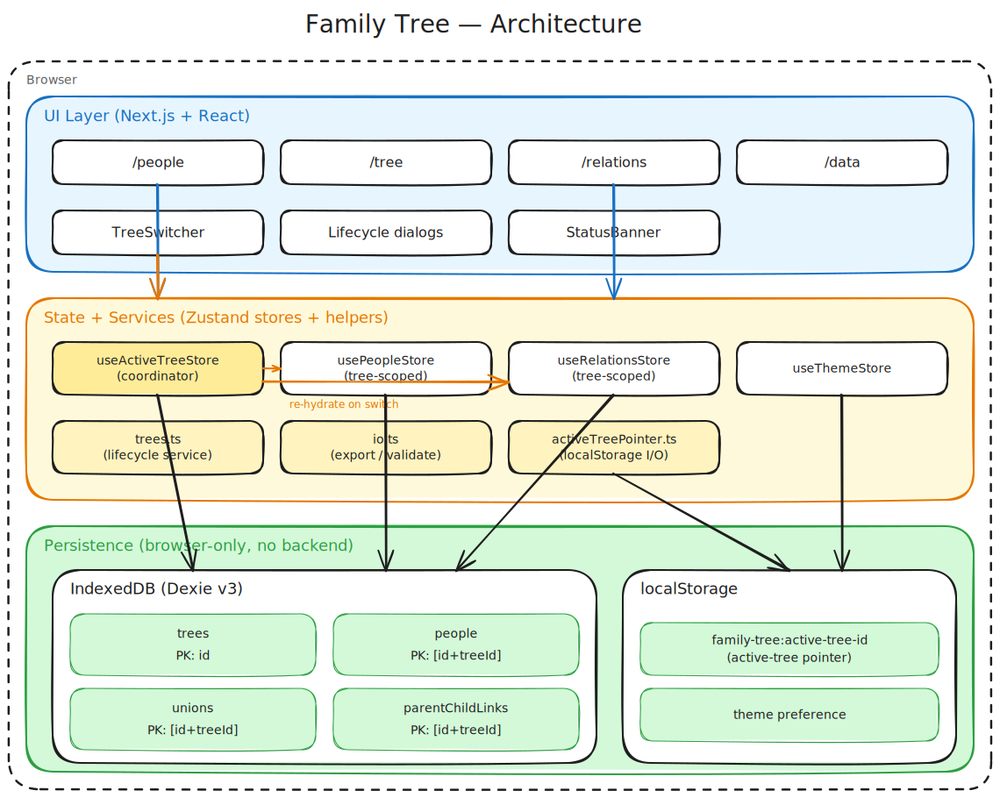

# Development Guide

Technical reference for contributors and curious readers. For end-user docs see [README.md](./README.md).

## Architecture overview



The app is **local-first**: a static Next.js bundle running entirely in the user's browser. There is no server, no API, and no network I/O for application data. Persistence is split between IndexedDB (structured data via Dexie) and `localStorage` (small scalars like the active-tree pointer and theme).

Three logical layers, top to bottom:

| Layer | Responsibility | Implementation |
|---|---|---|
| **UI** | Pages, dialogs, visualization | Next.js App Router + React 19 + shadcn/ui |
| **State + Services** | In-memory stores, lifecycle rules, IO | Zustand + plain TypeScript modules |
| **Persistence** | Durable storage in the browser | IndexedDB (Dexie) + `localStorage` |

A single **active-tree store** acts as the coordinator: lifecycle actions (create / switch / delete / import) mutate the registry, persist a pointer, and re-hydrate the scoped record stores. The pages render whatever the record stores contain — they never query the DB directly.

## Tech stack

| Concern | Choice |
|---|---|
| Framework | [Next.js 16](https://nextjs.org) (App Router, Turbopack dev) |
| Language | TypeScript 5.9 |
| UI library | React 19, [shadcn/ui](https://ui.shadcn.com), [lucide-react](https://lucide.dev) icons |
| Styling | [Tailwind CSS 4](https://tailwindcss.com) (via `@tailwindcss/postcss`) |
| State | [Zustand](https://zustand-demo.pmnd.rs) |
| Persistence | [Dexie 4](https://dexie.org) (IndexedDB wrapper) |
| Tree visualization | [@xyflow/react](https://reactflow.dev) (formerly React Flow) + [elkjs](https://www.npmjs.com/package/elkjs) layout |
| Image / PDF export | [html-to-image](https://github.com/bubkoo/html-to-image) + [jspdf](https://parall.ax/products/jspdf) |
| Tables | [@tanstack/react-table](https://tanstack.com/table) |
| Tests | [Vitest](https://vitest.dev), [fast-check](https://github.com/dubzzz/fast-check) (property-based), [fake-indexeddb](https://github.com/dumbmatter/fakeIndexedDB), [React Testing Library](https://testing-library.com) |

## Project structure

```
src/
├── app/                       # Next.js App Router
│   ├── layout.tsx             # Top bar, theme, active-tree bootstrap
│   ├── page.tsx               # Home
│   ├── people/                # /people  – CRUD on people
│   ├── relations/             # /relations – unions & parent-child links
│   ├── tree/                  # /tree – React Flow + ELK visualization
│   └── data/                  # /data – scoped export + import-as-new-tree
├── components/
│   ├── TreeSwitcher.tsx       # Active-tree dropdown in top bar
│   ├── CreateTreeDialog.tsx   # Lifecycle dialogs
│   ├── RenameTreeDialog.tsx
│   ├── DeleteTreeDialog.tsx
│   ├── StatusBanner.tsx       # Surfaces no-selection / unavailable / errors
│   ├── AddPersonDialog.tsx
│   └── ui/                    # shadcn primitives
├── lib/
│   ├── domain.ts              # Portable + stored types, constants
│   ├── db.ts                  # Dexie schema (v1 → v2 → v3) + migration
│   ├── activeTreePointer.ts   # localStorage-backed pointer
│   ├── activeTreeStore.ts     # Zustand store: registry + active id
│   ├── trees.ts               # Lifecycle service (create/rename/delete/import)
│   ├── store.ts               # usePeopleStore (tree-scoped)
│   ├── relationsStore.ts      # useRelationsStore (tree-scoped)
│   ├── io.ts                  # exportActiveTree + isSchemaEnvelopeV1
│   ├── elkLayout.ts           # ELK config for tree visualization
│   └── treeLayout.ts          # React Flow node/edge construction
├── store/themes-store.ts      # Light / dark theme preference
└── test/setup.ts              # fake-indexeddb + jest-dom + localStorage polyfill
```

## Data model

### Portable (export/import) shapes

The `SchemaEnvelopeV1` JSON is the on-disk format users export and import. It intentionally does *not* carry tree associations so files round-trip cleanly between trees.

```ts
interface PersonV1 {
  id: Id;                  // nanoid
  givenName: string;
  familyName?: string;
  birthDate?: string;      // ISO date
  deathDate?: string;
  gender?: 'male' | 'female' | 'other' | 'unknown';
  notes?: string;
  createdAt: string;
  updatedAt: string;
}

interface UnionV1 {
  id: Id;
  partnerIds: Id[];        // typically 2
  startDate?: string;
  endDate?: string;
  notes?: string;
  createdAt: string;
  updatedAt: string;
}

interface ParentChildV1 {
  id: Id;
  parentIds: Id[];         // 1 or 2 parents
  childId: Id;
}

interface SchemaEnvelopeV1 {
  version: 1;
  people: PersonV1[];
  unions: UnionV1[];
  parentChildLinks: ParentChildV1[];
}
```

### Stored (Dexie) shapes

Each portable shape becomes `Scoped<T> = T & { treeId: Id }` when persisted. The compound primary key `[id+treeId]` (added at v3) lets the same record id legitimately exist in multiple trees, which makes export / import round-trips lossless.

```ts
interface Tree {
  id: Id;            // unique across the registry
  name: string;      // 1..100 chars (trimmed); duplicates allowed
  createdAt: string;
}

type StoredPerson      = PersonV1     & { treeId: Id };
type StoredUnion       = UnionV1      & { treeId: Id };
type StoredParentChild = ParentChildV1 & { treeId: Id };
```

### Dexie schema versions

| Version | Change |
|---|---|
| v1 | Single implicit dataset. Tables: `people`, `unions`, `parentChildLinks`, all keyed on `id`. |
| v2 | Adds `trees` table and a `treeId` column on every record. Upgrade hook adopts pre-existing records into a "My Family Tree" Default_Tree. |
| v3 | Switches the primary key on the three record tables to compound `[id+treeId]` so a record id can recur across trees (required for round-trip imports). The portable `id` is kept as a secondary index. |

> **Migration caveat.** Dexie cannot change a primary key in place. A browser already at v2 with real records will throw `UpgradeError: Not yet support for changing primary key` when first opened at v3. Workarounds: (a) clear site data and re-import, or (b) write a v3 upgrade callback that recreates the tables. The latter is on the follow-up list.

## State management

```
useActiveTreeStore        usePeopleStore       useRelationsStore
   |                          |                    |
   |  bootstrap()             |  hydrate()         |  hydrate()
   |  setActiveTree()         |  addPerson()       |  addUnion()
   |  createTree()            |  updatePerson()    |  addParentChildLink()
   |  renameActiveOrTree()    |  deletePerson()    |  deleteUnion()
   |  deleteTree()            |                    |  deleteParentChildLink()
   |  importAsNewTree()       |                    |
   v                          v                    v
                         IndexedDB (Dexie)
```

- **`useActiveTreeStore`** owns the registry, the active-tree id, status, and orchestrates everything else. On `setActiveTree(id)` it persists the pointer to `localStorage` and re-hydrates both record stores; on failure it rolls back.
- **`usePeopleStore`** and **`useRelationsStore`** are tree-scoped: every read goes through `getPeopleByTree(activeTreeId)` etc., and writes stamp `treeId` from the active-tree store. They use the optimistic-update + DB-write + rollback pattern.
- **`useThemeStore`** is independent and persists a `light` / `dark` preference.

## Multi-tree behaviour at a glance

| Action | Effect |
|---|---|
| **Switch tree** | Active-tree id changes → pointer persisted → both record stores re-hydrate scoped to the new id |
| **Create tree** | New row in `trees` (1..100 char name, duplicates allowed) → new tree becomes active |
| **Rename tree** | Updates only the `name` field. Records of every tree are untouched. |
| **Delete tree** | Cascade-deletes the tree row plus every record `where treeId = id` in a single `rw` transaction. If the deleted tree was active, the most-recently-created remaining tree becomes active. If the registry would be empty, a default `"My Family Tree"` is created and activated. |
| **Import as new tree** | Validates `SchemaEnvelopeV1`, derives a name (provided → file name → date), atomically inserts the new tree row plus all stamped records inside a single transaction, then activates the new tree. The originating tree is untouched. |
| **Export** | Reads the active tree's records, strips `treeId`, and produces a portable `SchemaEnvelopeV1` JSON. |

## Testing

The suite uses Vitest with property-based testing via [fast-check](https://github.com/dubzzz/fast-check), running real Dexie code paths under [fake-indexeddb](https://github.com/dumbmatter/fakeIndexedDB).

### Run

```bash
npm test           # single-shot run
npm run test:watch # watch mode
```

### Property coverage

Twenty correctness properties (P1–P20) defined in [`.kiro/specs/multiple-family-trees/design.md`](./.kiro/specs/multiple-family-trees/design.md) all have backing tests. Each test file is tagged with `// Feature: multiple-family-trees, Property N: …`. Highlights:

| Property | Validates |
|---|---|
| P1 — Active-tree load isolation | Scoped reads return only the queried tree's records |
| P3 — Referential integrity | Every record's `treeId` references an existing tree; exactly one valid active tree |
| P4 — Cascade delete isolation | Deleting tree X removes only X's records |
| P9 — Never zero trees | Deleting the last tree creates `"My Family Tree"` |
| P14 / P15 — Migration | v1→v2 preserves all data; idempotent on re-open |
| P16 / P17 — Import | Valid envelope is isolated and complete; invalid is rejected with no side effects |
| P19 — Scoped export exactness | Exported envelope contains exactly the active tree's records, `treeId` stripped |
| P20 — Round-trip | Import-of-export reproduces every record's portable fields one-to-one |

Each property runs a minimum of 30 fast-check iterations (most run 100). The whole suite finishes in ~5 seconds.

## Build, lint, dev

| Command | Purpose |
|---|---|
| `npm run dev` | Next.js dev server with Turbopack at port 3000 |
| `npm run build` | Production build |
| `npm start` | Serve the production build |
| `npm run lint` | ESLint via `eslint-config-next` |
| `npm test` | Vitest single-shot |

## Deployment

The app is pure static + client-rendered, so any host that can serve a Next.js build works. The recommended path is Vercel — the project deploys with zero configuration. See [README.md](./README.md#deploy-your-own-copy-to-vercel).

For other hosts: `npm run build` produces a standard Next.js output; follow the [Next.js deployment docs](https://nextjs.org/docs/app/getting-started/deploying) for your provider of choice.

## Specs

This repo uses Kiro-style specs in `.kiro/specs/`:

- **`family-tree-app/`** — original single-tree feature plan.
- **`multiple-family-trees/`** — full requirements, design (with all 20 correctness properties), and an itemized task plan for the multi-tree feature.

Each spec contains `requirements.md`, `design.md`, and `tasks.md` and is the source of truth for the corresponding subsystem.
